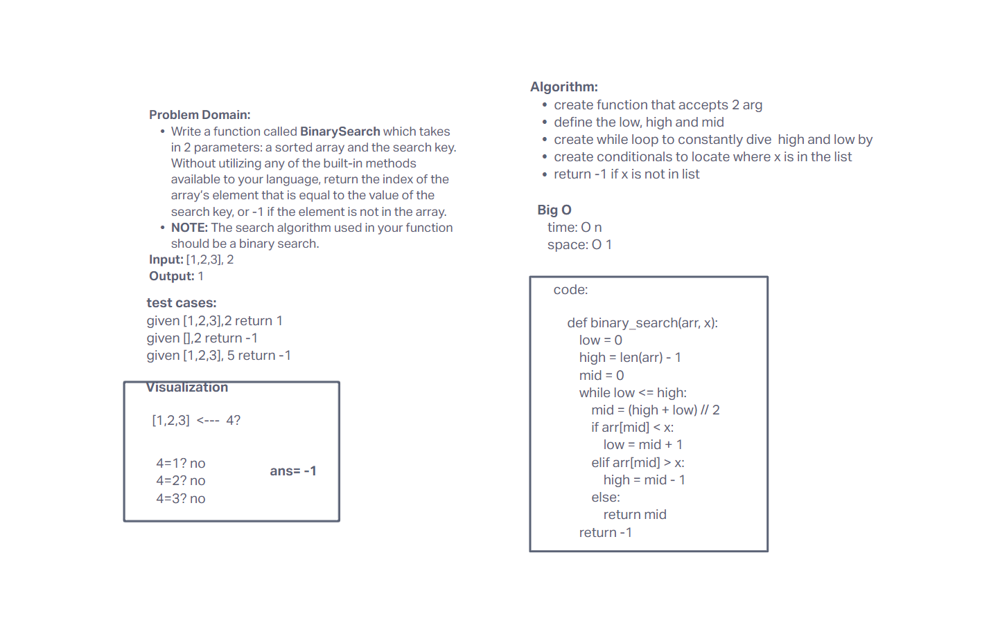

# Reverse an Array
Write a function called BinarySearch which takes in 2 parameters: a sorted array and the search key. Without utilizing any of the built-in methods available to your language, return the index of the array’s element that is equal to the value of the search key, or -1 if the element is not in the array.
NOTE: The search algorithm used in your function should be a binary search.

## Whiteboard Process

## Approach & Efficiency
I looked over the resources gave to us and used google to help me with understanding what binary search was
