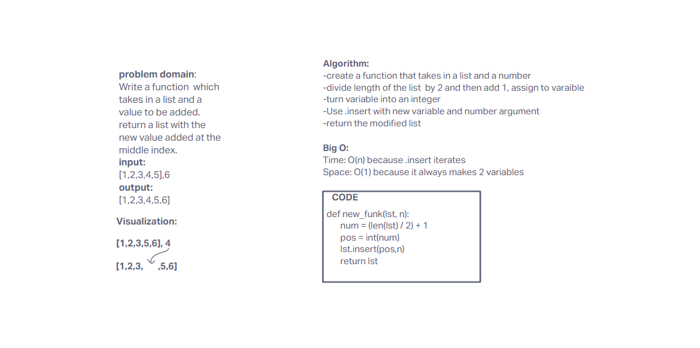

# Insert to Middle of an Array

Write a function called insertShiftArray which takes in an array and a value to be added. Without utilizing any of the built-in methods available to your language, return an array with the new value added at the middle index.

## Whiteboard Process

## Approach & Efficiency

First, I googled the .insert method, then realized I need to get to the middle of list by dividing the length by 2. That returns a float so I know I needed to use int() to turn it into a whole number.
