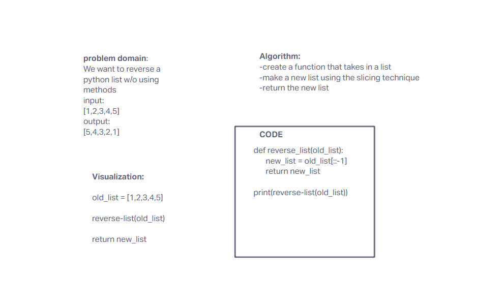

# Reverse an Array
need to reverse an array without using list methods

## Whiteboard Process

## Approach & Efficiency
I used google since I am not familiar with python, which led me to something called the slicing technique
