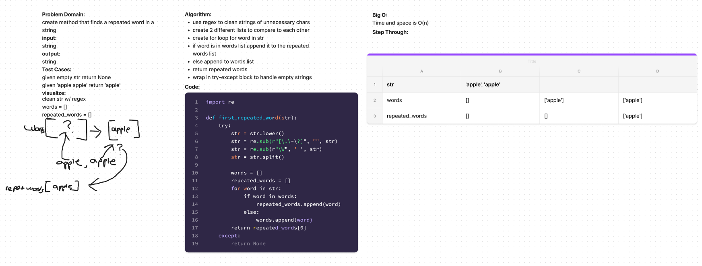

# Hashtable Repeated Words

## Challenge

create a hashtasble method to find a repeated word in a string

## Whiteboard

### API

This method uses regex to clean the str of unnecessary characters.
sets new lists to compare to eachother.
uses a loop to find the repeated word

### resources

Google
