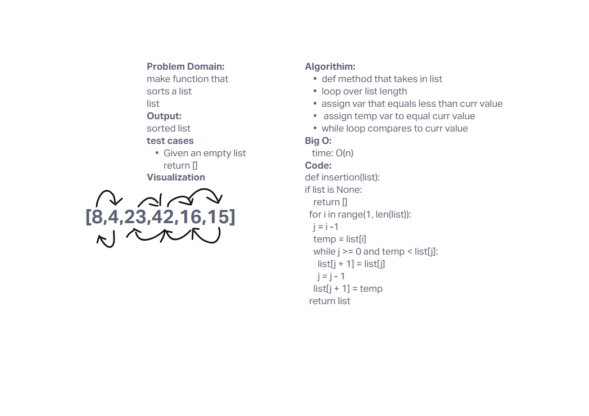

# Challenge Summary

make function that sorts a list

## Whiteboard Process
<!-- Embedded whiteboard image -->

## Approach & Efficiency
<!-- What approach did you take? Why? What is the Big O space/time for this approach? -->
Iterative approach

## Solution
<!-- Show how to run your code, and examples of it in action -->
insert list in function

couldnt get my test.py to work
