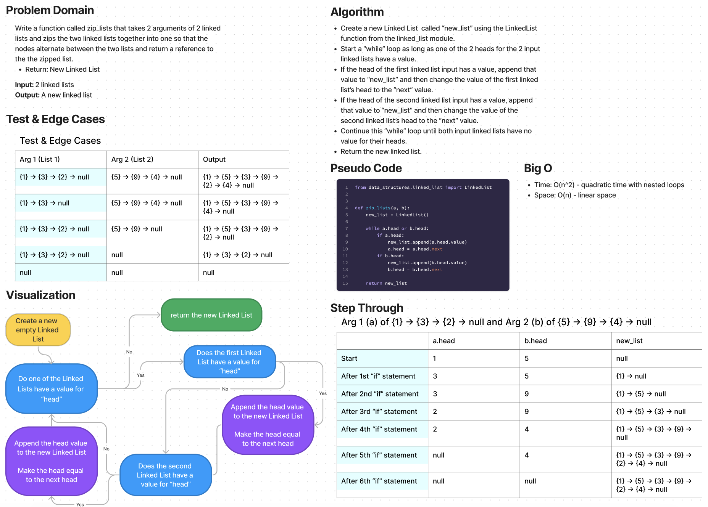

# Singly Linked List
Write a function called zip_lists that takes 2 arguments of 2 linked lists and zips the two linked lists together into one so that the nodes alternate between the two lists and return a reference to the zipped list. Return a new Linked List.

## Whiteboard

## Approach & Efficiency
the approach it told me
