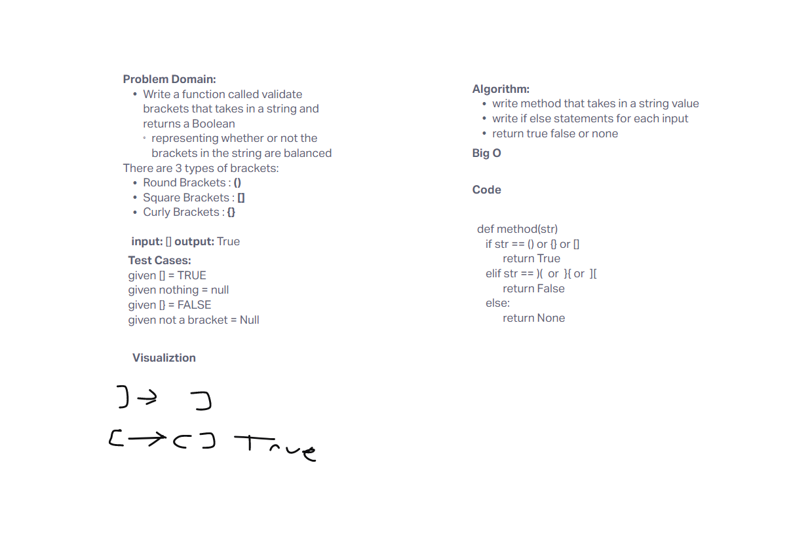

# Stacks and Queues
Create a method that validates brackets as true or False

## Challenge
Write a function called validate brackets
Arguments: string
Return: boolean
representing whether or not the brackets in the string are balanced
There are 3 types of brackets:

Round Brackets : ()
Square Brackets : []
Curly Brackets : {}

## Approach & Efficiency
I tested each tests input

## Whiteboard

