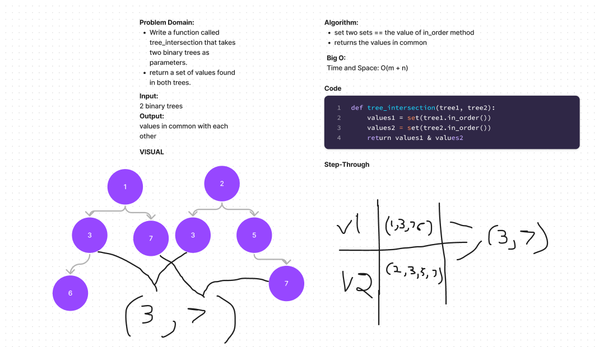

# Challenge Summary

Create a new method that takes in two binary trees and returns values that are in both trees

Methods:
in_order
Arguments: 2 trees

## Whiteboard Process

## Solution

utilises the in order method that already exists in our binary tree and returns them as sets.
