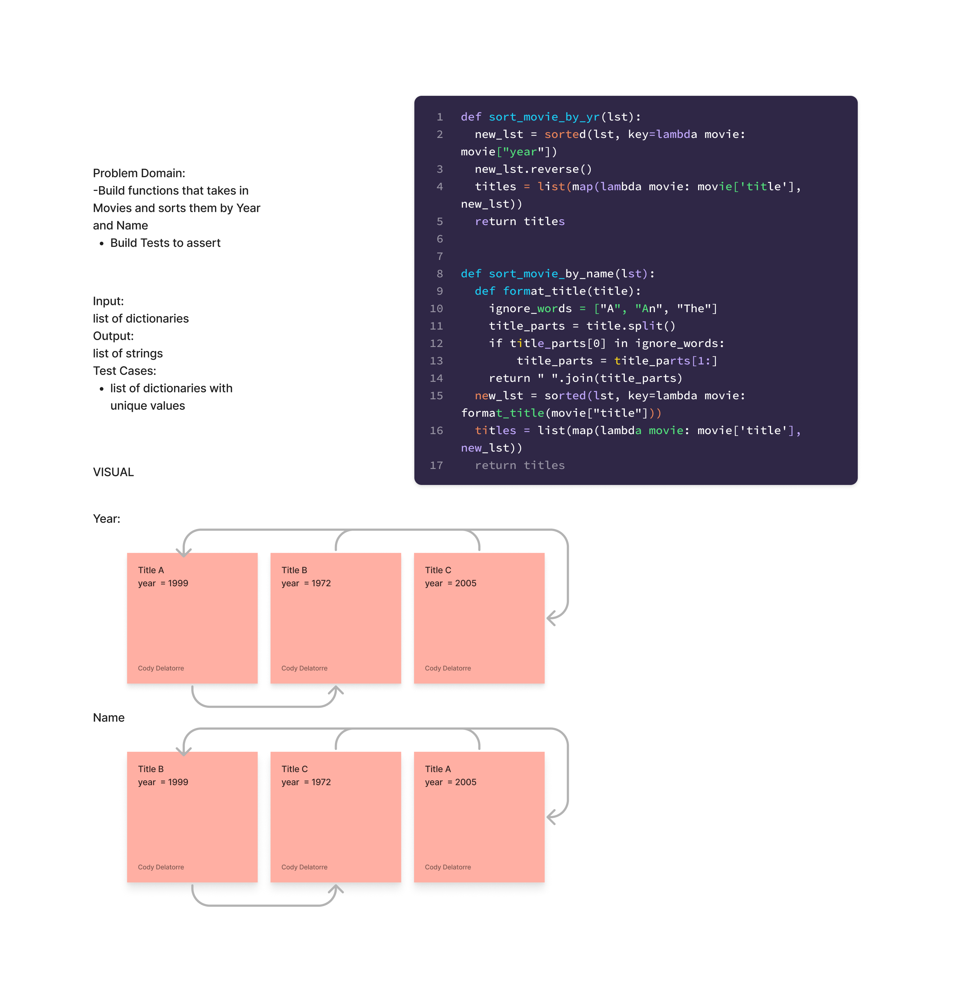

# Challenge Summary

Write two functions, one that sorts list of dictionaries by their year property and the other that sorts the same list by their title property

## Whiteboard Process

## Approach & Efficiency

Approach: iterate through list using sorted function and and list comprehension

## testing

pytest sorting/domain_objects/test.py`
